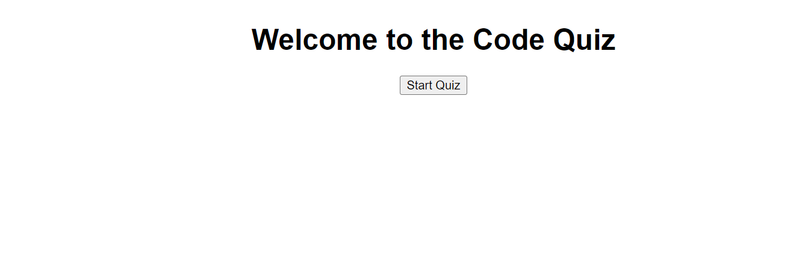

# <Code Quiz>

## Description

This was a project where I wanted to get more familiar with event listeners and using objects in javascript to update elements of a webpage. I got experience hiding and showing HTML elements by using event listeners to make changes to the webpage in JavaScript. I also got more experiencing using functions to store user inputs and I also fiddled around with local storage to save user's highscores.


## Usage


 
      ```md
    ![Question Screen Screenshot]](./assets/images/QuestionScreen.png)
    ```
      ```md
    
    ```

## Credits

Thanks to MDN and Stackoverflow for some example functions that were rekitted to fit my purposes. Also thanks to my dad who walked me through how to create the objects and dynamically update the content of the questions, as well as verifying the user input against the correct answer.

## License

Refer to the license section

---